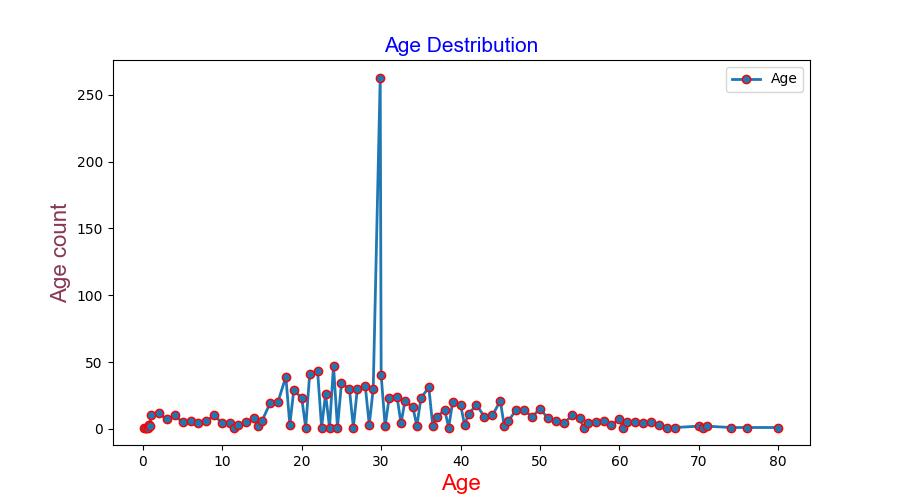
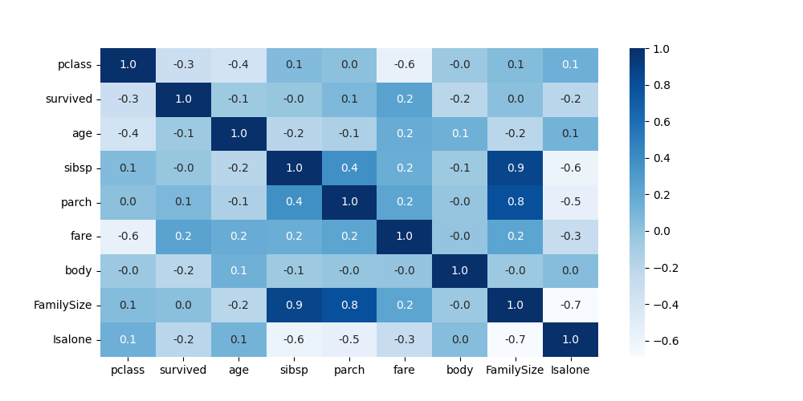
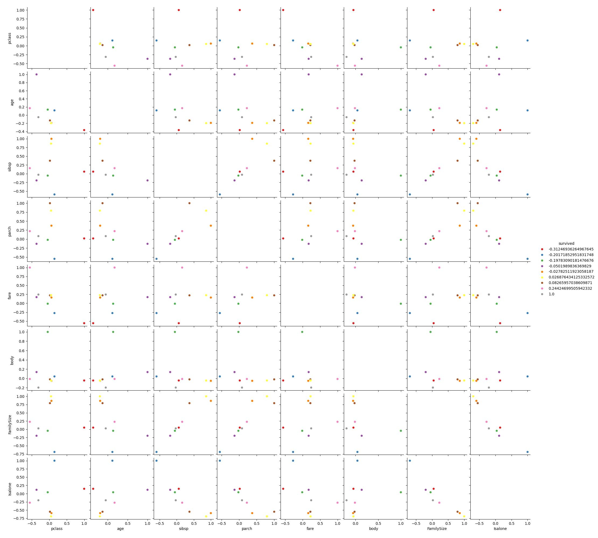
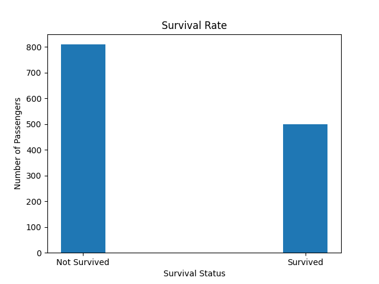
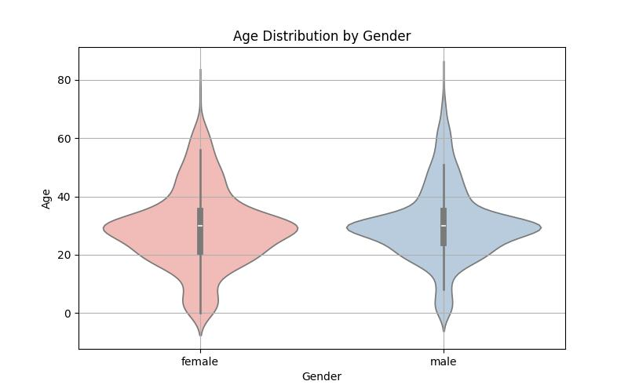
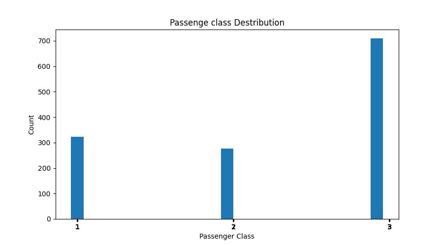

# Week 2: Python Fundamentals for Machine Learning

---

## 📘 Description
This notebook documents my learning progress for **Week 2 of the ML Internship (Batch-2) at Neuro App**.  
The focus of this week was building a strong foundation in **Python for Machine Learning**, including NumPy, Pandas, data visualization, and object-oriented programming.

---

## 📑 Table of Contents
- [NumPy Array Operations](#numpy-array-operations)
- [Pandas Data Manipulation](#pandas-data-manipulation)
- [Data Visualization with Matplotlib & Seaborn](#data-visualization-with-matplotlib--seaborn)
- [Object-Oriented Programming for ML](#object-oriented-programming-for-ml)

---

## NumPy Array Operations (3 hours)
In this section, I practiced:
- Creating arrays using `np.array`
- Reshaping arrays
- Array slicing and indexing
- Mathematical operations:
  - Addition
  - Subtraction
  - Multiplication
  - Matrix multiplication
  - Dot product

### Screenshots
.png)
.png)
.png)
.png)
.png)
.png)
.png)
.png)
.png)
##  Pandas Data Manipulation (4 hours)
In this notebook, I explored and manipulated the **Titanic dataset** using Pandas.

### Tasks performed:
- Data exploration and summary statistics
- Handling missing values (dropping and imputing)
- Feature engineering:
  - `FamilySize`
  - `IsAlone`
  - `Title`
  - `IsChild`
  - `HasCabin`

This step helped in preparing a cleaner and more informative dataset for ML models.

## 📊 Data Visualization with Matplotlib & Seaborn (3 hours)
Using Matplotlib and Seaborn, I visualized the Titanic dataset to better understand relationships between features.

### Plots created:
- Bar plot
- Histogram
- Line plot
- Pair plot
- Scatter plot
- Heatmap
- Box plot
- Violin plot

### Saved visualizations:

---

##  Object-Oriented Programming for ML (3 hours)
In this section, I applied **Object-Oriented Programming (OOP)** principles to machine learning workflows.

### Implemented class: `DataPreprocessor`
Methods included:
- `load_data()` – Load the dataset
- `handle_missing_values()` – Clean missing data
- `encode_categorical()` – Encode categorical variables (`sex`, `embarked`)
- `scale_features()` – Scale numerical features using `StandardScaler`
- `split_data()` – Split data into training and testing sets

### Outcome
A **cleaned, encoded, scaled, and split dataset**, ready for machine learning algorithms.

---

## 🚀 Skills Gained
- NumPy for numerical computation
- Pandas for data manipulation
- Data visualization with Matplotlib & Seaborn
- Feature engineering
- OOP for ML pipelines
- Data preprocessing best practices
